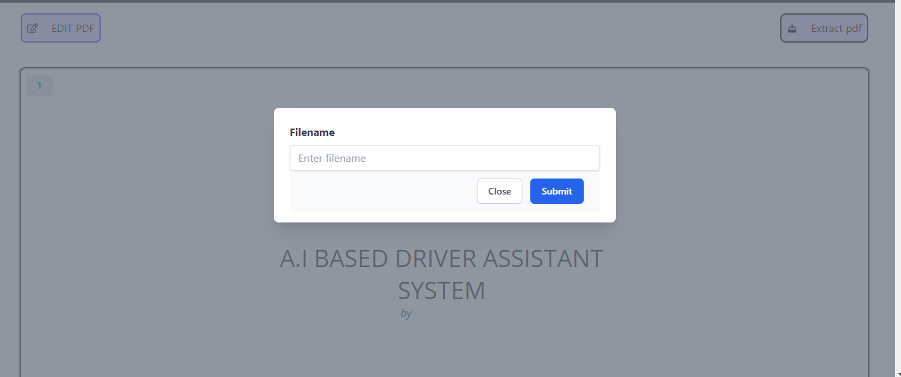

# PDF Extractor

This is a web application that allows users to upload a PDF, select specific pages, and generate a new PDF with only the selected pages.

## Table of Contents

* Features
* Installation
* Screenshots
* Usage

## Features

The PDF Extractor offers the following functionalities:

### Frontend (React.js)

* **PDF Upload:** Implemented a simple form to upload PDF files with validation to ensure only PDFs are accepted.
* **Page Preview:** Displays a visual representation of all pages in the uploaded PDF.
* **Page Selection:** Allows users to select the desired pages for extraction through checkboxes or a similar UI element.
* **PDF Creation:** Provides a button or functionality to generate a new PDF based on the chosen pages. Upon completion, offers a download link for the newly created PDF.
* **Responsive Design:** Ensures all pages adapt and work seamlessly on mobile devices.

### Backend (Node.js, Express.js)

* **PDF Upload Endpoint:** Created a route to handle PDF uploads and store them on the server.
* **PDF Retrieval Endpoint:** Created a route to retrieve stored PDF files for display.
* **PDF Extraction Endpoint:** Implemented a route to extract the selected pages from the original PDF and create a new PDF. 

## Installation

To run the application locally, follow these steps:

1. Clone the repository:

    git clone [https://github.com/MohitBhatt07/PDF-Extractor.git]

2. Install dependencies for the frontend:

    cd frontend

    npm install

3.  Install dependencies for the backend:

    cd backend

    npm install

4.  Create a .env file in the frontend directory with the following content:

    VITE_APP_SERVER_URL=http://localhost:8000

5.  Create a .env file in the backend directory with the following content:

    JWT_SECRET="your secret key"

    MONGO_URI="your mongodb cloud url"

    BASE_URL="frontend url"

6.  Start the frontend development server:
    
    cd frontend

    npm run dev

7. Start the backend server:
    
    cd backend

    npm start

## Screenshots

## Usage

  1. Navigate to the application in your web browser.
  2. Upload a PDF file by clicking the "Upload PDF" button and selecting the desired file.
  3. Once uploaded, you'll see a visual representation of all pages in the PDF.
  4. Select the pages you want to extract by checking the corresponding checkboxes.
  5. Click the "Create PDF" button to generate the new PDF with the selected pages.
  6. Download the newly created PDF by clicking the download link.

